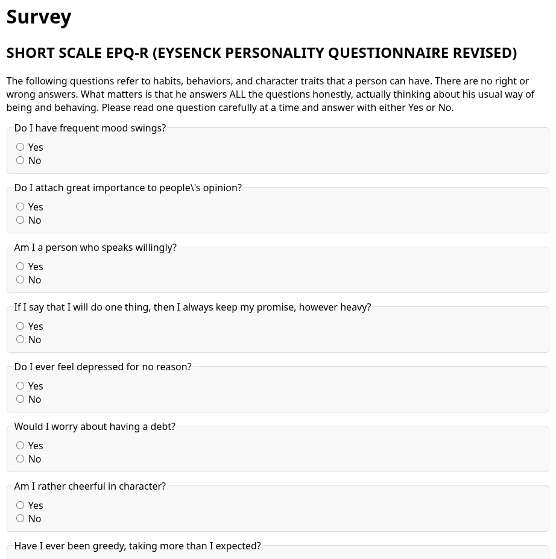
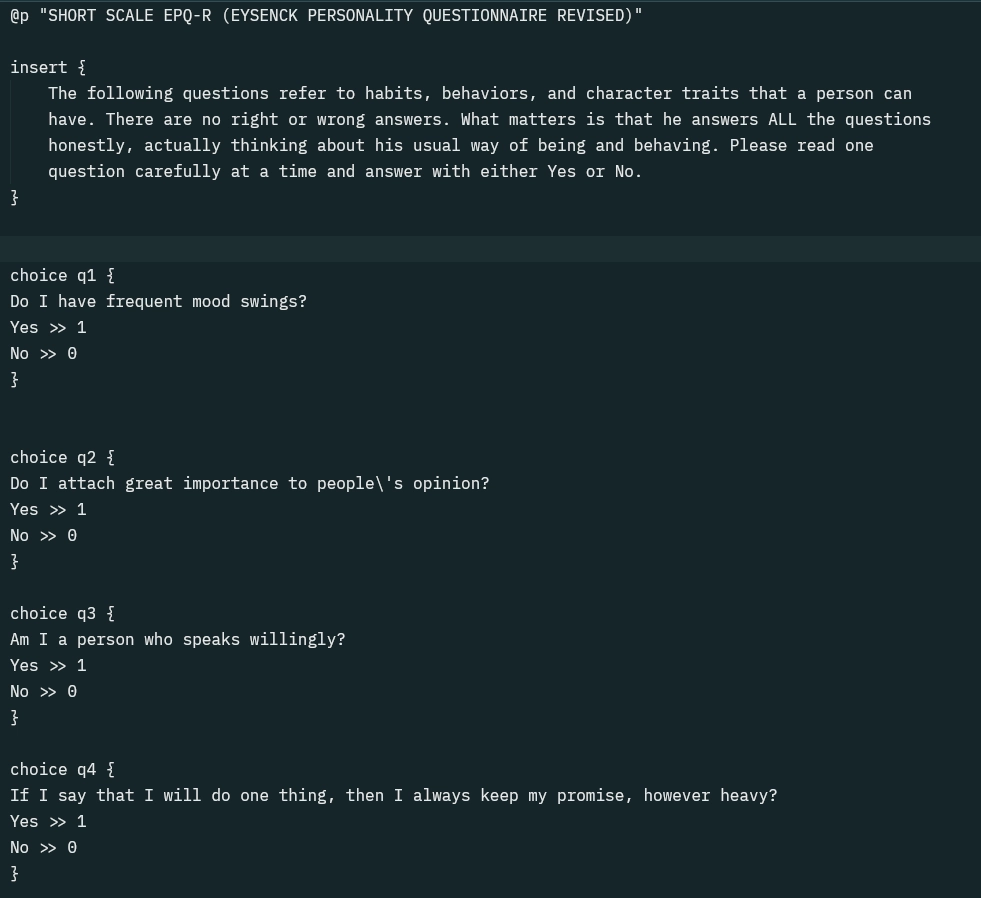

# SQE: Scriptable Questionnaire Ecosystem

SQE is a Scriptable questionnaire ecosystem that allows users to create and customize their own questionnaires using a simple and intuitive syntax.

Here’s a comparison of before vs after:

  
  

## Reference Documents
Each document dives into a **specific feature**.

- [Example](./syntax/example.md){.md-button .md-button--primary .md-button--raised}  
- [Print](./syntax/print.md){.md-button .md-button--primary .md-button--raised}  
- [Choice](./syntax/choice.md){.md-button .md-button--primary .md-button--raised}  
- [Page](./syntax/page.md){.md-button .md-button--primary .md-button--raised}

- [function.md](./syntax/function.md){.md-button .md-button--primary .md-button--raised}
- [title.md](./syntax/title.md){.md-button .md-button--primary .md-button--raised}

